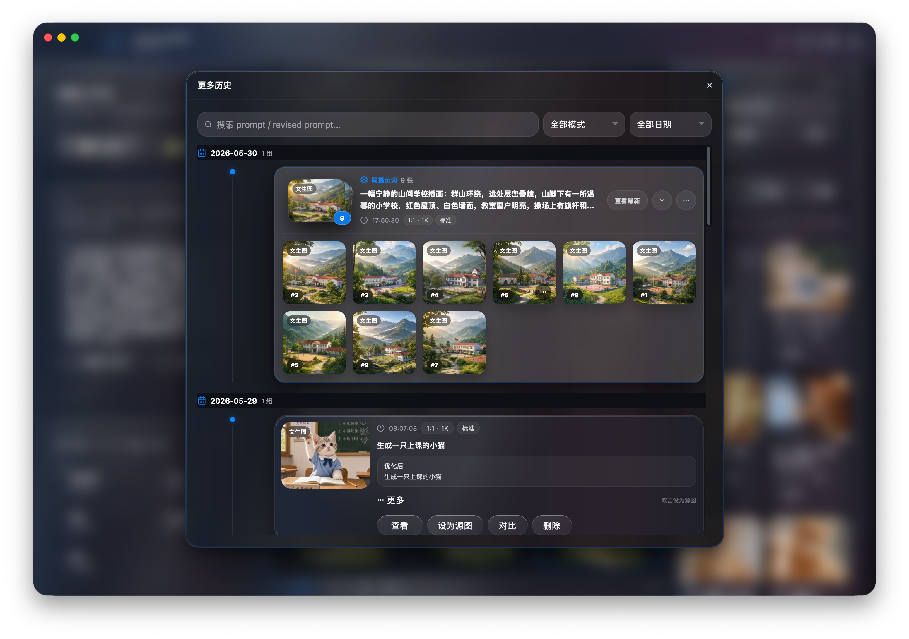
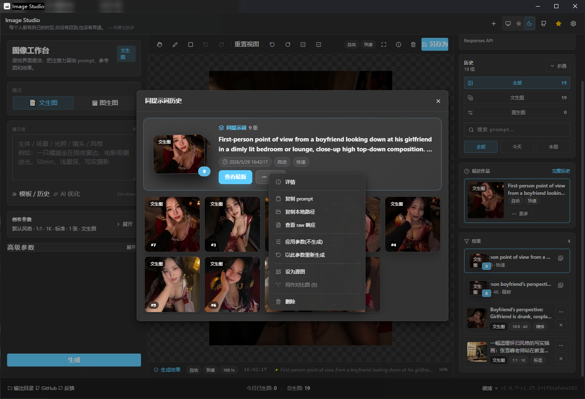
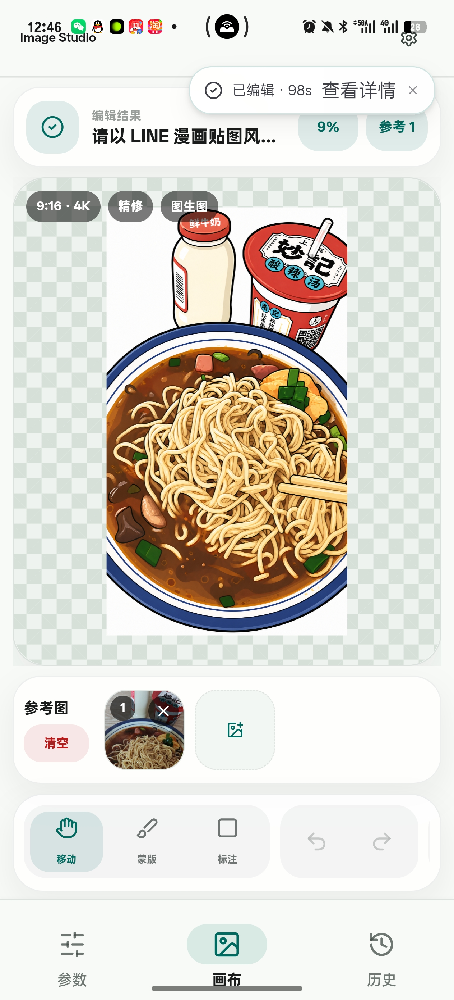

# FHL 魔改版入口

这是 `FHL-Image-Studio方汤圆CLI魔改版 V2.0.0` 的交付包。Codex CLI 生成成功后必须读取 stdout JSON 的 `imagePath`，并把生成图片用 Markdown 图片语法传回 Codex 对话框预览。人工 UI 和 Codex CLI 的完整使用说明请先看：

- [桌面使用说明-交付版.md](./桌面使用说明-交付版.md)
- [Codex接管与初始化指南.md](./Codex接管与初始化指南.md)
- [README-魔改版V2.0.0.md](./README-魔改版V2.0.0.md)

本包默认使用 FHL Responses API：`https://www.fhl.mom`、`gpt-5.5`、`gpt-image-2`。下面内容是上游 Image Studio 原项目说明，作为源码结构和原版能力参考。

---

# Image Studio

> 开源图像生成 / 编辑客户端 · Wails(Go + React/TS) 桌面端 + Android WebView 壳层 ·
> 支持 Responses API SSE 保活与标准 Images API

Image Studio 面向 OpenAI 兼容图像上游，解决长时间图像推理在 Cloudflare / Nginx 后面容易遇到的 524/504 断连问题。Responses API 模式通过 SSE 持续接收事件来保持连接活跃；Images API 模式则兼容标准 `/v1/images/generations` 与 `/v1/images/edits`。

项目不内置任何默认上游。首次启动会要求你填写 BASE_URL、API Key、文本模型与图像模型。

---

  
   
  
   
  
   
  macOS · Windows · Android 端界面预览

---

## 快速入口

| 内容 | 文档 |
|---|---|
| 功能清单、平台能力、快捷键 | [docs/features.md](./docs/features.md) |
| 下载、源码构建、Android APK、验证脚本、CI 产物 | [docs/build.md](./docs/build.md) |
| 首次配置、API 形态选择、参数策略 | [docs/usage.md](./docs/usage.md) |
| 数据存储位置、524/504、模型权限、字段兼容问题 | [docs/troubleshooting.md](./docs/troubleshooting.md) |
| 仓库结构、前端分层、内核/Worker/Android 关系 | [docs/project-structure.md](./docs/project-structure.md) |
| 原始提示词传递策略 | [docs/no-prompt-revision/README.md](./docs/no-prompt-revision/README.md) |
| Android 壳层维护说明 | [android-shell/README.md](./android-shell/README.md) |
| 跨平台内核计划与验证背景 | [docs/cross-platform-kernel-plan.md](./docs/cross-platform-kernel-plan.md) |
| 反馈渠道、问题提交、QQ群讨论 | [docs/feedback.md](./docs/feedback.md) |

## 当前能力概览

| | |
|---|---|
| SSE 保活 | Responses API 模式使用 `/v1/responses` 和 `image_generation` 工具接收流式事件，适合长推理和 CF 524/504 场景。 |
| 标准 Images API | 支持 `/v1/images/generations` 文生图与 `/v1/images/edits` 图生图，兼容只开放 image 分组的中转站。 |
| 双端内核 | 桌面端优先走 Go/Wails 本地内核；Android / 浏览器预览可走前端远程内核，Android 壳层提供 native HTTP、文件与保存桥接。 |
| 图像编辑器 | 多参考图、蒙版、标注、旋转、翻转、裁剪、历史对比、复制粘贴、撤销重做。 |
| 多 workspace | 每个标签独立保存 prompt、参数、源图与当前画板状态。 |
| 平台化 UI | macOS Apple 风格、Windows Fluent 风格、Linux 通用桌面风格、Android Material 3 phone/pad 自适应壳层。 |
| 本地数据 | API Key、历史、图片和日志默认都保存在本机；外部请求只发往你配置的上游 BASE_URL。 |
| 原始提示词 | Responses API 请求默认要求文本模型把用户 prompt 原样交给图像工具。 |
## 安装

稳定版本到 [Releases](https://github.com/RoseKhlifa/Image-Studio/releases) 下载。当前发布链路会产出:

- `image-studio-windows-amd64.exe`
- `image-studio-windows-arm64.exe`
- `image-studio-macos-universal.zip`
- `image-studio-linux-amd64.tar.gz`
- `image-studio-linux-arm64.tar.gz`
- `image-studio-android-release.apk`

源码构建、平台依赖、Android APK、验证脚本见 [构建文档](./docs/build.md)。

## 快速上手

1. 启动后打开「上游配置」。
2. 选择 API 形态:
   - Responses API:抗 524/504，默认文本模型 `gpt-5.5`，图像模型 `gpt-image-2`。
   - Images API:标准图像接口，适合只支持 image 分组的上游。
3. 填入 BASE_URL、API Key、模型 ID，保存后点「测试连接」。
4. 选择文生图或图生图，输入 prompt，设置比例、质量、输出格式和风格。
5. 点击「生成」，或使用 `Cmd/Ctrl + Enter`。

更完整的配置说明见 [使用文档](./docs/usage.md)。

---

## License

[MIT](./LICENSE) © 2026

---

## 致谢

-  [**linux.do**](https://linux.do/) —— 感谢 L 站及其社区为项目开发与交流提供的支持与启发。

### 赞助商

  
    
  
    
  

---

