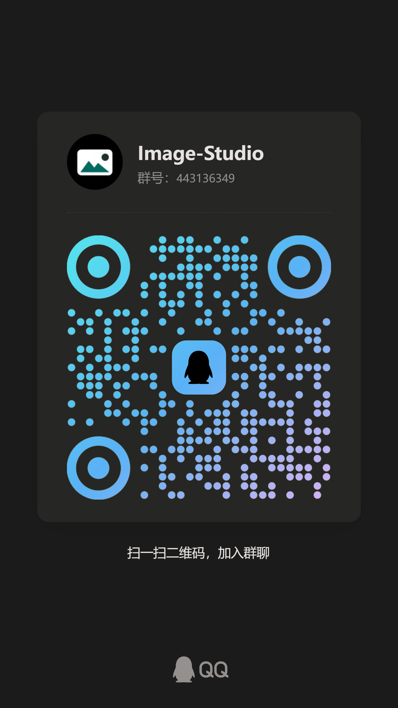

# 反馈渠道

如果你在使用 Image Studio 时遇到问题，或希望讨论新功能、使用方式与兼容性，可以通过下面的渠道反馈。

## GitHub Issues

适合提交可复现的问题、功能建议、构建失败、平台兼容性和文档修正。

- Issues 地址: [https://github.com/RoseKhlifa/Image-Studio/issues](https://github.com/RoseKhlifa/Image-Studio/issues)
- 建议附上系统平台、应用版本、API 形态、上游 BASE_URL 类型、错误日志或截图。
- 如果是生成失败，请尽量说明使用的是 Responses API 还是 Images API，以及对应模型 ID。

## QQ 群讨论

适合日常交流、使用经验分享、临时问题排查和测试版本反馈。

- QQ 群号: `443136349`
- 群名称: Image-Studio

  
   
  扫码加入 QQ 群讨论

